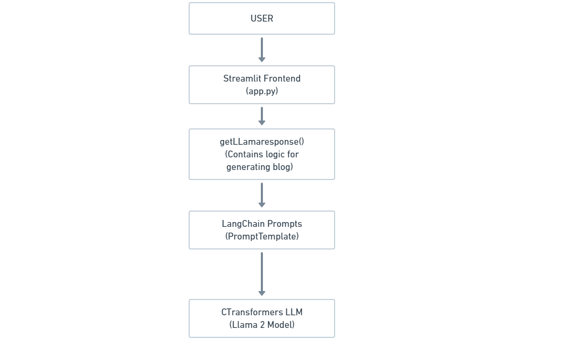
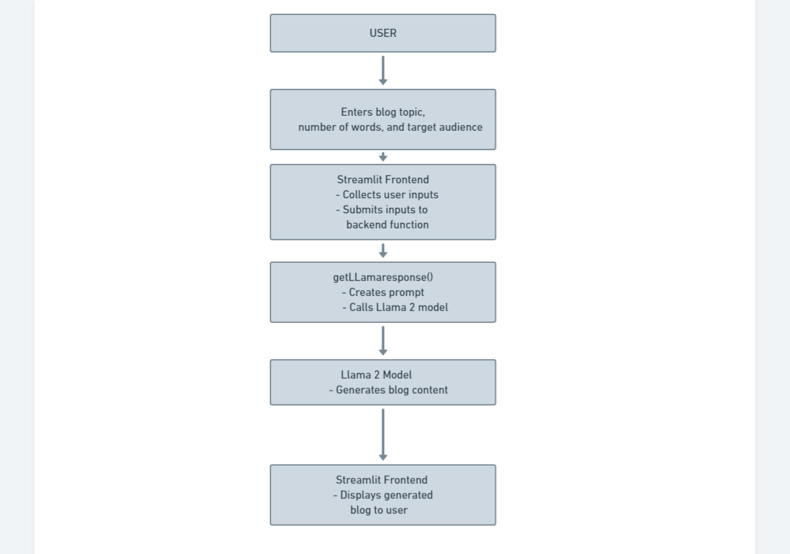

# Blog Generator Application

This application is designed to generate blog posts using the Llama 2 language model. The user can specify the topic, desired length, and target audience for the blog post.

## Installation

1. Clone the repository:
    ```sh
    git clone https://github.com/yourusername/blog-generator.git
    ```
2. Navigate to the project directory:
    ```sh
    cd blog-generator
    ```
3. Install the required dependencies:
    ```sh
    pip install -r requirements.txt
    ```

## Running the Application

To run the application, use the following command:
```sh
streamlit run app.py
```

## Usage

1. Enter the desired blog topic in the "Enter the blog topic" input field.
2. Specify the number of words for the blog in the "No of Words" input field.
3. Select the target audience for the blog from the dropdown menu. The options are:
    - Researchers
    - Data Scientist
    - Common People
4. Click the "Generate" button to generate the blog post.

The generated blog post will be displayed on the screen.

## System Architecture 


## Data Flow Diagram 


## Code Explanation

### Imports

```python
import streamlit as st
from langchain.prompts import PromptTemplate
from langchain.llms import CTransformers
```

### Function to Get Response from Llama 2 Model

```python
def getLLamaresponse(input_text, no_words, blog_style):
    # Llama2 Model
    llm = CTransformers(model='models/llama-2-7b-chat.ggmlv3.q8_0.bin',
                        model_type='llama',
                        config={'max_new_tokens': 256,
                                'temperature': 0.01})

    # Prompt Template
    template = f"""
    Write a blog for {blog_style} job profile for a topic {input_text}
    within {no_words} words.
    """

    prompt = PromptTemplate(input_variables=["blog_style", "input_text", "no_words"],
                            template=template)

    # Generate response from LLama 2 Model
    response = llm(prompt.format(style=blog_style, text=input_text, no_words=no_words))
    print(response)
    return response
```

### Streamlit Configuration

```python
st.set_page_config(page_title="Generate Blogs",
                   page_icon='🤖',
                   layout='centered',
                   initial_sidebar_state='collapsed')

st.header("Generate Blogs 🤖")
```

### User Input Fields

```python
input_text = st.text_input("Enter the blog topic")

col1, col2 = st.columns([5, 5])

with col1:
    no_words = st.text_input('No of Words')

with col2:
    blog_style = st.selectbox('Writing the blog for', ('Researchers', 'Data Scientist', 'Common People'), index=0)
```

### Generate Button

```python
submit = st.button("Generate")
```

### Displaying the Response

```python
if submit:
    st.write(getLLamaresponse(input_text, no_words, blog_style))
```

## Notes

- Ensure you have the Llama 2 model (`llama-2-7b-chat.ggmlv3.q8_0.bin`) in the `models` directory.
- Adjust the model and config parameters as necessary based on your specific requirements and hardware capabilities.

## License

This project is licensed under the MIT License. See the [LICENSE](LICENSE) file for details.

## Contact

For any inquiries or issues, please contact [yourname@domain.com](mailto:yourname@domain.com).